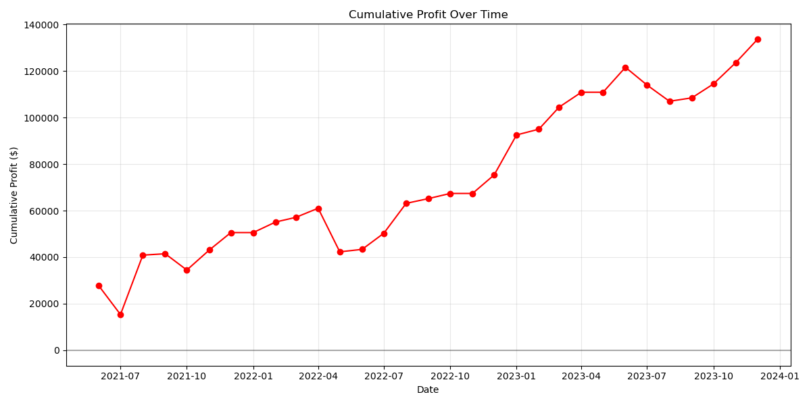

# A Markov Chain-Based Trading Strategy for Cryptocurrency Markets

This repository contains the source code and research paper for a quantitative trading strategy that uses a Markov chain model to forecast short-term price movements in cryptocurrency markets.

**Read the full paper: [paper.pdf](paper.pdf)**

## Abstract

> The advent of algorithmic trading has fundamentally transformed financial markets, enabling the systematic execution of trading strategies at speeds and frequencies unattainable by human traders. This paradigm shift has spurred a continuous search for sophisticated quantitative models that can identify and exploit market inefficiencies. A crucial component of this process is rigorous backtesting, which involves simulating a trading strategy on historical data to assess its viability and estimate its potential performance. Without robust backtesting, a strategy that appears profitable in theory may fail spectacularly in live trading due to unforeseen market dynamics, transaction costs, or model overfitting. This paper presents a novel trading strategy that utilizes a Markov chain model to forecast short-term price movements in the highly volatile cryptocurrency markets.

## Key Results

The strategy was backtested on SOL/USDT 1-hour data from 2019 to 2024 using a walk-forward analysis.

### Performance Metrics

| Metric                  | Value        |
| :---------------------- | :----------- |
| **Average Sharpe Ratio**| 2.91         |
| **Average Sortino Ratio**| 261.22       |
| **Average Profit Factor**| 12.11        |
| **Average Win Rate**    | 72.70%       |
| **Average Max Drawdown**| 12.5%        |
| **Total Trades**        | 111          |
| **Total Profit**        | $133,628.72  |

### Equity Curve



## Methodology Overview

The core of the strategy is to discretize market behavior into a finite set of states based on price action and trading volume. By analyzing historical data, the model identifies "useful sequences" of states that have a high probability of preceding a specific bullish or bearish movement. These sequences are then used to generate trading signals.

The system is designed with a high degree of realism, incorporating:
- **Walk-Forward Analysis:** To prevent overfitting.
- **Dynamic Risk Management:** Stop-loss and take-profit levels are based on the Average True Range (ATR).
- **Transaction Costs:** Commission and slippage are included in the simulation.
- **Hyperparameter Optimization:** The `hyperopt` library is used to find the optimal model parameters.

## Repository Structure

- `paper.md`/`paper.pdf`: The research paper detailing the strategy and results.
- `main.py`: The main script to run the backtesting and analysis.
- `backtester.py`: The core backtesting engine.
- `data_processor.py`: Scripts for data loading and state classification.
- `optimizer.py`: Script for hyperparameter optimization.
- `*.feather`: The dataset files (e.g., `SOL_USDT-1h.feather`).
- `requirements.txt`: Python dependencies.

## Setup and Usage

### 1. Setup Environment

It is recommended to use a Python virtual environment.

```bash
python -m venv .venv
source .venv/bin/activate
```

Install the required dependencies:

```bash
pip install -r requirements.txt
```

### 2. Run Backtest

The main backtesting logic is in `main.py`. The script is currently configured to run with `ETH_USDT-1h.feather`. You can modify the `if __name__ == "__main__":` block in `main.py` to change the dataset or parameters.

To run the default backtest:

```bash
python main.py
```

The results, including monthly performance metrics and visualizations, will be saved to the `backtest_results_...` directory specified in the script.
